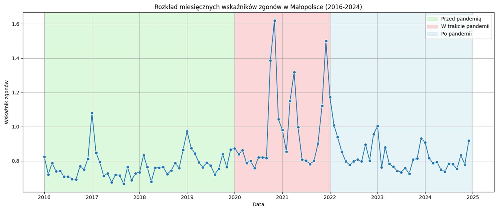
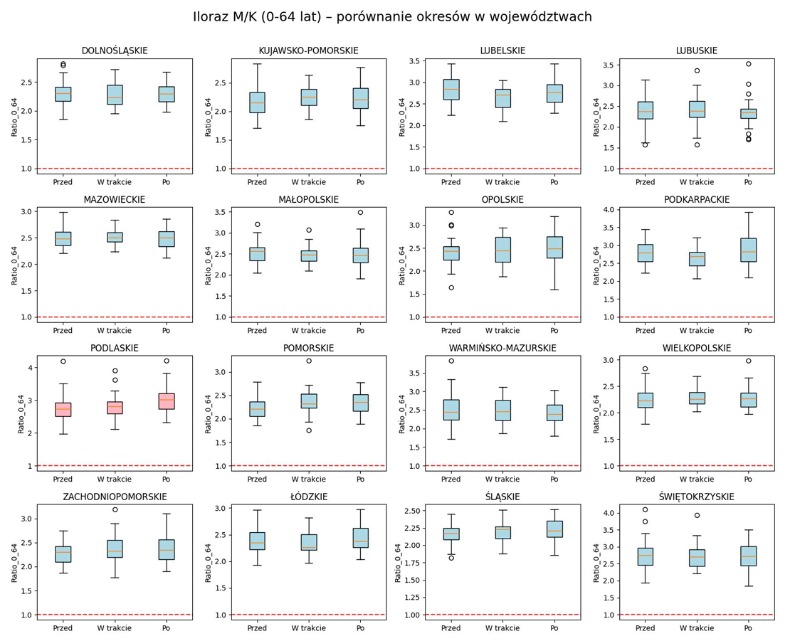
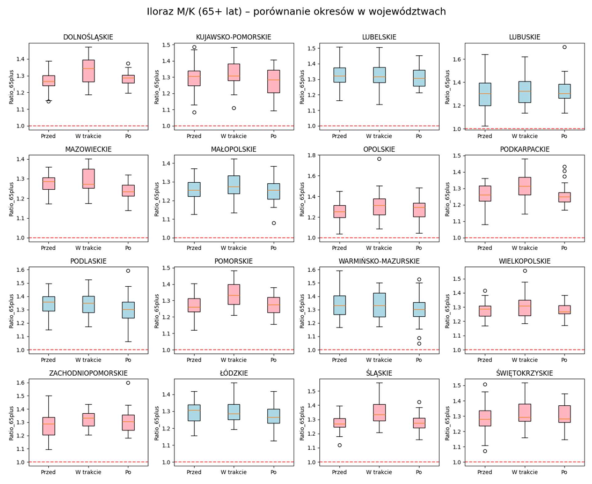
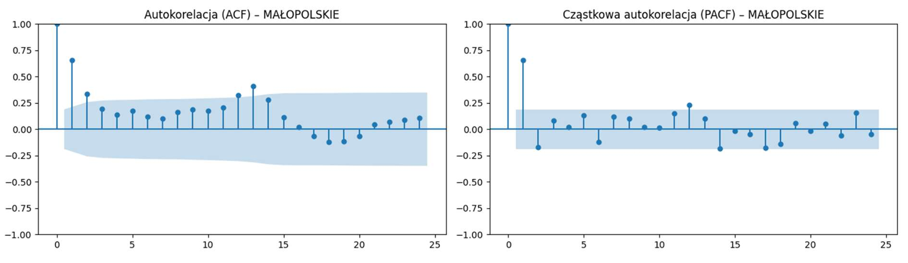
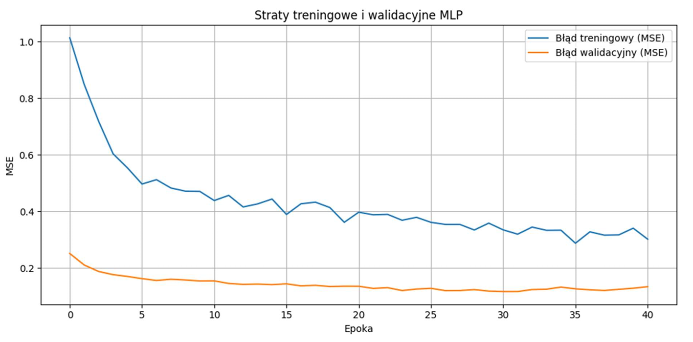
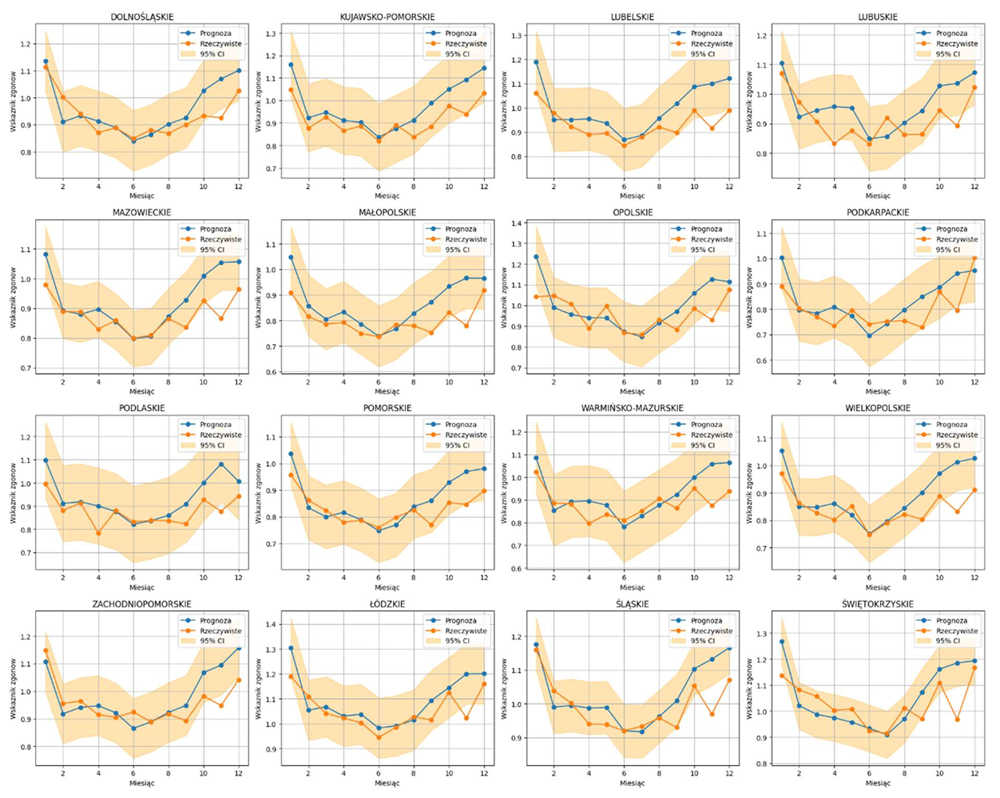
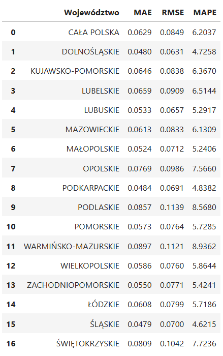

# Mortality Rate Analysis in Poland (2016–2024)

This project uses a Multi-Layer Perceptron (MLP) neural network to predict monthly mortality rates across Polish provinces. The model leverages historical time series data, capturing seasonal patterns, regional differences, and temporal dependencies. It demonstrates how artificial neural networks can be applied to forecast demographic indicators and analyze trends over time.

---

## 1. Descriptive Analysis

**Objective:** Examine mortality trends across all 16 voivodeships and monthly distribution for Małopolskie.

**Observations:**
- Sharp increase in 2020–2021 due to COVID-19 pandemic.
- Post-2022: decreased and stabilized, but still above pre-pandemic levels.
- Highest mortality: Łódzkie, Świętokrzyskie, Śląskie, Lubelskie.
- Lowest mortality: Małopolskie, Pomorskie, Wielkopolskie, Podkarpackie.
- Seasonal pattern: higher in autumn-winter, lower in spring-summer.

**Figures:**
- 
- 

---

## 2. Statistical Tests

**Gender differences:**
- OLS regression shows significant differences between men and women in all regions and age groups.

**Changes over time:**
- Friedman test identifies which regions were significantly affected by the pandemic.

**Key Results:**
- **Age 0–64:** median male/female ratio >2 in all regions; significant difference in Podlaskie.
- **Age 65+:** male mortality still higher, greater fluctuations; some regions show no significant differences.

**Figures:**
- 
- 

---

## 3. Autocorrelation Analysis (ACF & PACF)

**Purpose:** Detect temporal dependencies in mortality data.

**Findings (Małopolskie):**
- Annual seasonality (significant ACF peak at 12 months).
- PACF: lags 1, 2, and 12 most relevant; longer lags negligible.

**Implication:** Lagged variables can be used as input in predictive models.

**Figures:**
- 

---

## 4. Feature Preparation

**Data:** Monthly mortality rates for 16 voivodeships (2016–2023).  

**Input features:**
- Lagged values (previous 12 months) to capture temporal dependencies.
- One-Hot Encoded voivodeship identifiers.
- Cyclic representation of months (sin/cos) to preserve seasonality.
- Standardization of numerical features (mean=0, std=1).
---

## 5. MLP Model

**Architecture:**
- Input layer: all prepared features.
- One hidden layer with 12 neurons, ReLU activation.
- Dropout layer (0.2) to reduce overfitting.
- Output layer: single neuron for mortality rate prediction.
- Loss function: Mean Squared Error (MSE).
- Optimizer: Adam.

---

## 6. Training and Validation

**Procedure:**
- Supervised learning using historical data.
- Training set: 2016–2022, Validation set: 2023.
- No shuffling → chronological order preserved.
- Early stopping applied based on validation loss.

**Figure:**
- 

---

## 7. 2024 Mortality Prediction

**Prediction approach:**
- Iterative monthly prediction using lagged inputs.
- Standardization and inverse transformation applied to predicted values.
- 95% empirical confidence intervals computed based on 2023 validation errors.

**Figure:**
- 

---

## 8. Forecast Quality Assessment

**Metrics used:**
- **MAE (Mean Absolute Error):** Average absolute deviation of predictions from actual values.
- **RMSE (Root Mean Square Error):** Penalizes larger errors more heavily.
- **MAPE (Mean Absolute Percentage Error):** Average percentage error relative to actual values.

**Evaluation approach:**
- **Global:** Assessment across all voivodeships and months of 2024.
- **Regional:** Assessment individually for each voivodeship to identify differences in model performance.

**Figure/Table placeholders:**
- 

**Notes:**  
Global metrics show moderate errors, generally within acceptable ranges (MAE ~0.07–0.08, MAPE ~7–8%). Regional metrics reveal variation between voivodeships, with better predictions for densely populated regions and larger errors in smaller or more variable regions.

---

## 9. Analysis of Forecast Results

### 9.1 Global Analysis
- Predictions reproduce overall trends and seasonal patterns for the whole country.
- Relative errors remain low on average, indicating good generalization of the MLP model.
- Large errors are rare and do not significantly affect global accuracy.

### 9.2 Regional Analysis
- Performance varies between voivodeships.
- Best predictions are in regions with larger populations and stable mortality rates.
- Higher errors occur in regions with smaller populations or more volatile mortality rates.
- Seasonal patterns (winter peaks, summer drops) are captured in all regions.

### 9.3 Comparison with Historical Data
- Model correctly reflects post-pandemic stabilization of mortality rates.
- Seasonal fluctuations are well captured for all voivodeships.
- Predictions generally follow trends of historical observations while avoiding overestimation of pandemic-era spikes.

---

## 10. Limitations
- Short historical data series limits long-term trend prediction.
- Rare or extreme events may not be predicted accurately.
- Model does not include economic or health-related explanatory variables.
- Only tested on 2024 data, limiting assessment of long-term stability.

---

## 11. Summary and Conclusions
- MLP model effectively predicts mortality rates and captures seasonal dynamics.
- Performance is better in regions with large populations and stable trends.
- Regional differences suggest potential improvement by adding explanatory features.
- Approach confirms the usefulness of neural networks for demographic time series prediction.
- Future work could include longer data series and additional variables for improved accuracy.

